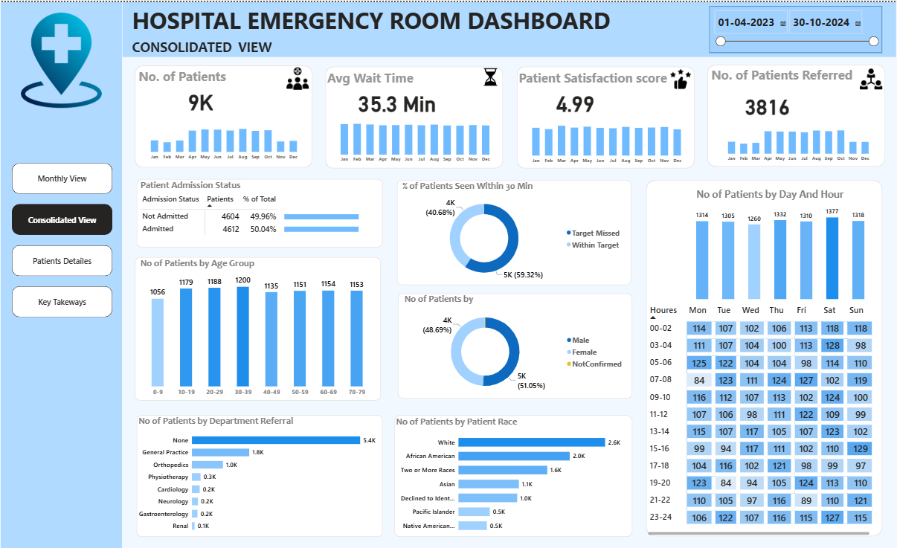
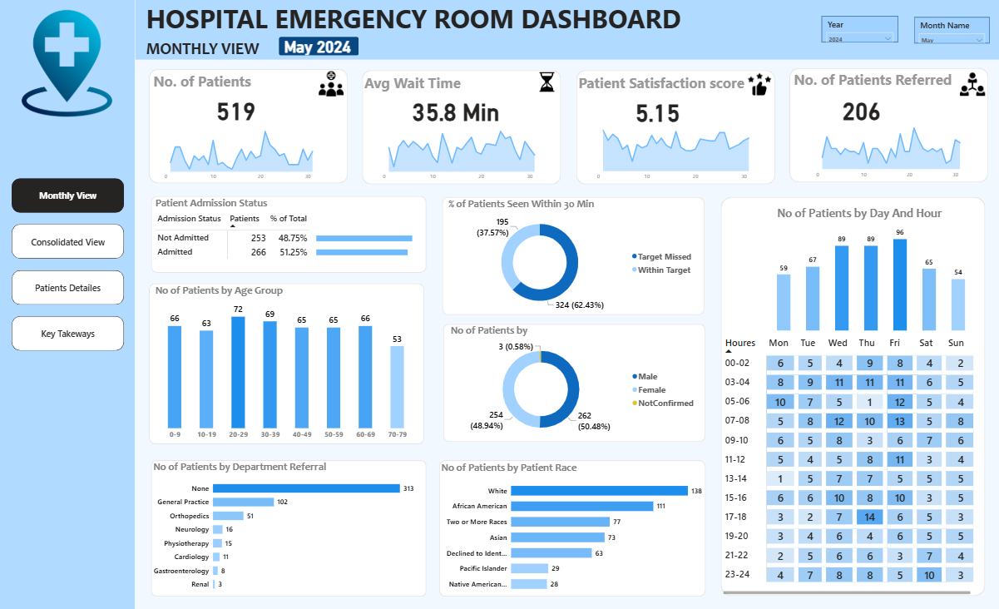
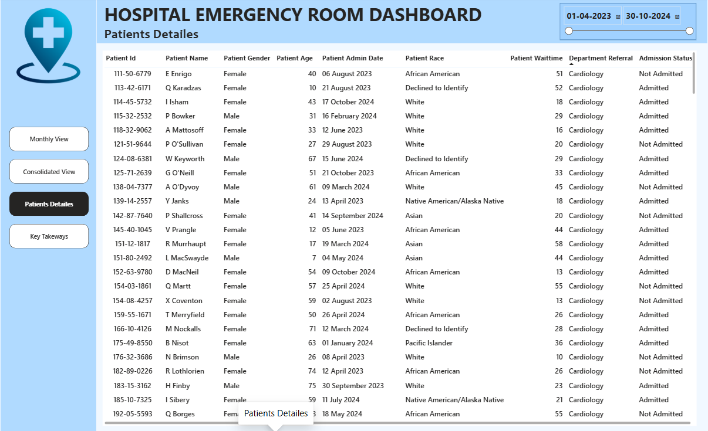
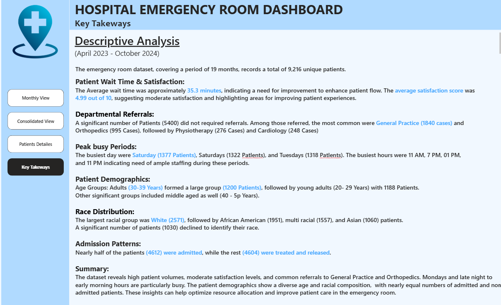

# 🏥 Hospital Emergency Room Dashboard | Power BI

<p align="center">
  
</p>

An interactive **Power BI Dashboard** developed to analyze Hospital Emergency Room (ER) operations and transform raw healthcare data into actionable business insights. The dashboard enables hospital administrators and stakeholders to monitor patient flow, waiting time, operational efficiency, referrals, and patient demographics through interactive visualizations.

---

# 📌 Project Overview

Emergency departments generate large volumes of patient data every day. This project demonstrates how Power BI can be used to clean, model, analyze, and visualize healthcare data to support data-driven decision making.

The dashboard allows users to:

- 📊 Monitor patient volume
- ⏱ Analyze average waiting time
- ⭐ Measure patient satisfaction
- 🏥 Track patient admissions
- 👨‍⚕️ Analyze department referrals
- 👥 Explore patient demographics
- 📅 Identify peak hospital hours
- 🔍 Drill down into patient-level records
- 📈 Generate meaningful business insights

---

# 🎯 Business Objectives

The dashboard answers important business questions such as:

- How many patients visit the Emergency Room?
- What is the average patient waiting time?
- Are patients being seen within the target time?
- Which departments receive the highest referrals?
- Which age groups visit the ER most frequently?
- Which days and hours are the busiest?
- What are the patient admission trends?
- How satisfied are patients with the service?
- What operational improvements can be made?

---

# ✨ Dashboard Features

✔ Interactive Slicers

✔ Dynamic KPI Cards

✔ Monthly Performance Analysis

✔ Consolidated Hospital Overview

✔ Patient-Level Drill Down

✔ Department Referral Analysis

✔ Patient Demographics

✔ Heatmap Analysis

✔ Business Insights & Recommendations

---

# 📊 Dashboard Pages

## 1️⃣ Monthly View

Provides a month-wise overview of Emergency Room performance.

### Includes:

- Total Patients
- Average Wait Time
- Patient Satisfaction Score
- Number of Referrals
- Admission Status
- Age Group Distribution
- Gender Distribution
- Department Referral Analysis
- Race Distribution
- Day & Hour Heatmap

---

## 2️⃣ Consolidated View

Provides an overall summary for a selected date range.

### Includes:

- KPI Cards
- Overall Patient Trends
- Referral Analysis
- Demographics
- Wait Time Analysis
- Patient Distribution
- Interactive Date Filters
- Hospital Performance Summary

---

## 3️⃣ Patient Details

Provides patient-level records for detailed analysis.

### Fields Included

- Patient ID
- Patient Name
- Gender
- Age
- Admission Date
- Patient Race
- Wait Time
- Department Referral
- Admission Status

Useful for filtering and detailed patient analysis.

---

## 4️⃣ Key Takeaways

Summarizes important insights generated from the dashboard.

Includes:

- Patient Wait Time Analysis
- Satisfaction Trends
- Peak Hospital Hours
- Referral Analysis
- Demographic Insights
- Admission Statistics
- Business Recommendations

---

# 📈 Key Performance Indicators (KPIs)

- 👥 Total Patients
- ⏱ Average Wait Time
- ⭐ Patient Satisfaction Score
- 🏥 Patients Referred
- ✅ Patients Seen Within 30 Minutes
- 🚑 Admission Status
- 👨‍⚕️ Department Referrals
- 👶 Age Group Distribution
- 👨 Gender Distribution
- 🌍 Race Distribution

---

# 🧮 DAX Measures Used

The dashboard uses DAX measures to calculate key business metrics, including:

- Total Patients
- Average Wait Time
- Average Patient Satisfaction Score
- Number of Patients Referred
- Patients Seen Within 30 Minutes
- Admission Count
- Admission Percentage
- Dynamic KPI Calculations

---

# 🛠 Tools & Technologies

- Microsoft Power BI Desktop
- Power Query
- DAX (Data Analysis Expressions)
- Data Modeling
- Data Cleaning
- Data Transformation
- Interactive Dashboard Design
- Data Visualization

---

# 📂 Dataset

**Source:** Kaggle

**Dataset:** Hospital Emergency Dataset by Xavier Berge

https://www.kaggle.com/datasets/xavierberge/hospital-emergency-dataset

The dataset contains anonymized Emergency Room patient records, including:

- Patient Demographics
- Admission Details
- Department Referrals
- Patient Wait Time
- Patient Satisfaction Score
- Visit Information

---

# 📁 Project Structure

```
Hospital-Emergency-Room-Dashboard
│
├── Hospital_Emergency_Room_Dashboard.pbix
├── Hospital_ER_Data.csv
├── README.md
│
└── images
    ├── monthly_view.png
    ├── consolidate_view.png
    ├── Patients_detailes.png
    └── Key_Takeways.png
```

---

# 📷 Dashboard Preview

## 🗓 Monthly View



---

## 📊 Consolidated View


---

## 👥 Patient Details



---

## 📌 Key Takeaways



---

# 📚 Project Workflow

The dashboard was developed following a structured Business Intelligence workflow:

1. Requirement Gathering
2. Business Requirement Analysis
3. Data Collection
4. Data Cleaning (Power Query)
5. Data Transformation
6. Data Modeling
7. DAX Measure Creation
8. Dashboard Design
9. Report Development
10. Insight Generation
11. Business Recommendations

---

# 💡 Key Insights

- The average patient waiting time is approximately **35 minutes**, indicating opportunities to improve patient flow.
- Nearly **50%** of patients were admitted, while the remaining were treated and discharged.
- **General Practice** received the highest number of referrals.
- Adults aged **20–39 years** represented the largest patient group.
- Patient visits vary significantly by **day and hour**, helping identify peak staffing requirements.
- Patient satisfaction remained moderate, highlighting opportunities to improve service quality.

---

# 📈 Business Impact

This dashboard helps hospital administrators to:

- Monitor Emergency Room performance
- Identify peak patient hours
- Improve resource allocation
- Reduce patient waiting time
- Track referral patterns
- Monitor patient satisfaction
- Support data-driven healthcare decisions

---

# 🚀 Skills Demonstrated

- Data Cleaning
- Data Transformation
- Power Query
- Data Modeling
- DAX Measures
- KPI Development
- Interactive Dashboard Design
- Business Intelligence
- Healthcare Analytics
- Data Visualization
- Report Design
- Insight Generation

---

# 📖 What I Learned

During this project, I gained hands-on experience in:

- Designing professional Power BI dashboards
- Building interactive reports
- Creating DAX measures
- Transforming data using Power Query
- Designing KPI cards
- Building healthcare analytics reports
- Converting raw data into business insights
- Dashboard storytelling and visualization best practices

---

# 🔮 Future Improvements

- Add Drill-through pages
- Add Bookmark Navigation
- Add Tooltip Pages
- Optimize DAX Measures
- Publish the dashboard using Power BI Service
- Connect to a live SQL database for real-time reporting

---

# 👨‍💻 Author

## Gaurav Mali

**Aspiring Data Analyst**

### Skills

- Power BI
- SQL
- Python
- Excel

📌 GitHub: https://github.com/Gaurav-mali12

If you found this project useful, consider giving it a ⭐ to support the project.
